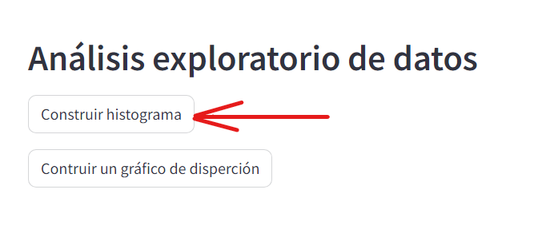
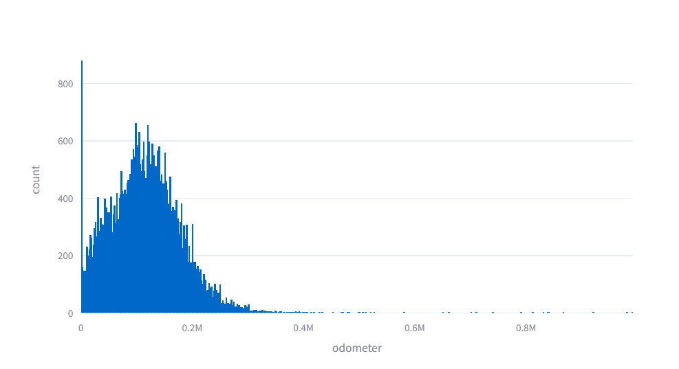

# Análisis exploratorio de datos
Este proyecto de análisis exploratorio de datos, proporciona información sobre precios de autos de acuerdo a su odómetro (distancia recorrida).

## Propósito
El propósito de este proyecto no se centra tanto en el análisis de los datos, sino en practicar como crear una app utilizando streamlit. Colocando un encabezado, botones, checkbox y agregando texto.

## ¿Qué hace?
Muestra un histograma con la información de los diferentes vehículos que se encuentran en el archivo csv.
También muestra un gráfico de dispesrión que relaciona la distancia recorrida con el precio del vehículo.

## ¿Cómo funciona?
Para mostrar el tipo de gráfico que se desea, basta con hacer clic en el botón indicado. Por ejemplo hacer clic en el botón con la leyenda Histograma:

Después de hacer clic en el boton aparecerá una gráfica como se muestra en la imagen, además de una breve descripción

## Acceso a la página web
Para poder ver el resultado final de la app, puedes hacer clic en el siguiente enlace:
[App de Análisis exploratorio](https://docs.streamlit.io/library/api-reference/widgets/st.checkbox)